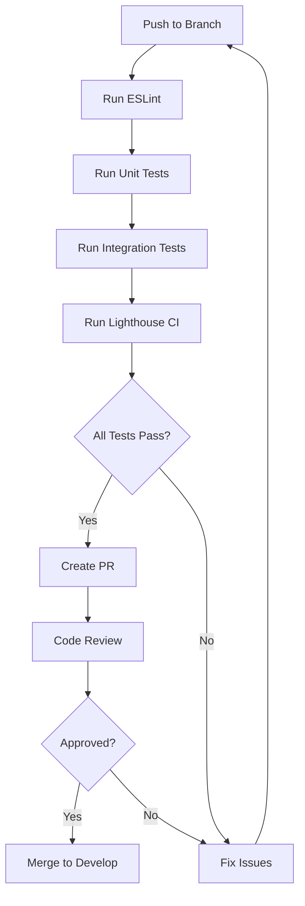

# Sprint 001 - UX Improvements

**Sprint ID:** SPRINT-001
**Sprint Name:** UX Improvements & Production Readiness
**Status:** Planned
**Start Date:** 2025-11-04
**End Date:** 2025-11-13 (7-9 days)
**Sprint Goal:** Transform PassaBola from functional MVP to polished, production-ready application with exceptional user experience

## Sprint Metadata

| Attribute            | Value                                              |
| -------------------- | -------------------------------------------------- |
| **Sprint Duration**  | 7-9 days                                           |
| **Total Commits**    | 7 semantic commits                                 |
| **Quality Gates**    | WCAG 2.1 AA, Lighthouse 90+                        |
| **Responsive Range** | 320px - 1920px                                     |
| **Tech Stack**       | Next.js 15, React 19, Tailwind CSS 4               |
| **Project Type**     | FIAP Partnership - Women's Football Social Network |

## Executive Summary

This sprint focuses on comprehensive UX enhancements across 7 critical areas of the PassaBola application. The goal is to elevate the user experience from a functional MVP to a production-ready application that meets professional quality standards, accessibility guidelines, and performance benchmarks.

### Key Focus Areas

1. **Notifications UX** - Enhanced interaction patterns with tabs, batch actions, skeleton states
2. **Chat & Chatbot UX** - Improved layout, navigation, and visual feedback
3. **Profile UX** - Better content organization and search capabilities
4. **Landing Page UX** - Mobile-first responsive design with clear CTAs
5. **General UX** - CSS-only improvements for loading, empty, and error states
6. **Testing** - Comprehensive functional, responsive, and performance tests
7. **Documentation** - Complete project documentation for maintainability

## Sprint Objectives

### Primary Objectives

- Implement tab-based navigation for notifications (Todas/Lidas/Não Lidas)
- Create 2-column chat layout with mobile-responsive navigation
- Add profile content tabs (Posts/Times/Jogos)
- Redesign landing page with responsive hero section
- Implement CSS-only loading, empty, and error states
- Achieve WCAG 2.1 AA accessibility compliance
- Reach Lighthouse score of 90+ across all metrics
- Create comprehensive project documentation

### Success Criteria

| Criteria          | Target                | Measurement                |
| ----------------- | --------------------- | -------------------------- |
| **Accessibility** | WCAG 2.1 AA           | Axe DevTools audit         |
| **Performance**   | Lighthouse 90+        | Lighthouse CI              |
| **Responsive**    | 320px - 1920px        | Manual testing + automated |
| **Code Quality**  | ESLint passing        | CI/CD pipeline             |
| **Test Coverage** | Core features tested  | Jest/Playwright            |
| **Documentation** | Complete /docs folder | Review checklist           |

## Sprint Team

### Roles & Responsibilities

| Role                   | Responsibilities                                    | Time Allocation |
| ---------------------- | --------------------------------------------------- | --------------- |
| **Frontend Developer** | Implement UI/UX improvements, component development | 80%             |
| **QA Engineer**        | Test planning, execution, accessibility audits      | 15%             |
| **Technical Writer**   | Documentation creation and maintenance              | 5%              |
| **Scrum Master**       | Sprint facilitation, blocker removal                | Support role    |

### Team Collaboration

- **Daily Standups:** 15 minutes at 09:00 BRT
- **Code Reviews:** Required for all PRs before merge
- **Pair Programming:** Encouraged for complex features
- **Documentation:** Updated continuously alongside code changes

## Detailed Task Breakdown

### Commit 1: Notifications UX Enhancement

**Branch:** `feat/notifications-ux`
**Estimated Effort:** 1 day
**Priority:** High

#### Tasks

1. **Tab Navigation Implementation**

   - [x] Create `NotificationTabs` component with three tabs: Todas/Lidas/Não Lidas
   - [x] Implement tab state management using React useState
   - [x] Add active tab styling with accent color border
   - [x] Ensure keyboard navigation (Tab, Arrow keys) for accessibility

2. **Batch Actions**

   - [x] Add "Selecionar Tudo" checkbox in header
   - [x] Implement individual notification checkboxes
   - [x] Create batch action bar with "Marcar como Lidas" and "Deletar Selecionadas"
   - [x] Add confirmation modal for bulk delete operations

3. **Skeleton Loading States**

   - [x] Enhance `NotificationCardSkeleton` with shimmer animation
   - [x] Show 5 skeleton cards during initial load
   - [x] Implement smooth transition from skeleton to actual content

4. **Empty States**

   - [x] Create EmptyState component with icon, title, description, and CTA
   - [x] Add context-specific empty states for each tab
   - [x] Include friendly messaging and suggestions

5. **Swipe Gestures (Mobile)**
   - [x] Test existing swipe implementation on touch devices
   - [x] Refine swipe threshold and animation timing
   - [x] Add haptic feedback for action confirmation (if supported)

#### Acceptance Criteria

- Tabs switch instantly without network delay
- Batch actions work with 1+ notifications selected
- Skeleton states show for max 2 seconds during load
- Empty states display when no notifications match filter
- Swipe gestures work smoothly on iOS and Android devices
- All interactive elements have ARIA labels
- Focus management works correctly with keyboard navigation

#### Technical Notes

```javascript
// Example tab structure
const tabs = [
  { id: "all", label: "Todas", count: totalCount },
  { id: "read", label: "Lidas", count: readCount },
  { id: "unread", label: "Não Lidas", count: unreadCount },
];
```

---

### Commit 2: Chat & Chatbot UX Enhancement

**Branch:** `feat/chat-ux`
**Estimated Effort:** 1.5 days
**Priority:** High

#### Tasks

1. **2-Column Layout (Desktop)**

   - [x] Split chat page into sidebar (conversations) and main (messages)
   - [x] Set sidebar width to 320px, main area flexible
   - [ ] Add resize handle between columns (optional)
   - [x] Persist layout preferences in localStorage

2. **Mobile Navigation**

   - [x] Show conversation list by default on mobile
   - [x] Slide to message view when conversation selected
   - [x] Add back button in message header to return to list
   - [x] Implement slide transition animation

3. **Online Indicators**

   - [x] Add green dot (8px) next to online users
   - [x] Position indicator on avatar (top-right corner)
   - [x] Update status via WebSocket presence events
   - [x] Add "Ativo agora" or "Visto há X min" text

4. **Improved Message Bubbles**

   - [x] Increase padding to px-4 py-3 for better readability
   - [x] Add subtle shadow to own messages for depth
   - [x] Implement message delivery status (sent/delivered/read)
   - [x] Show typing indicator when user is typing

5. **Chatbot Enhancements**
   - [x] Add bot avatar and name "Assistente PassaBola"
   - [x] Differentiate bot messages with distinct styling
   - [x] Implement quick reply buttons for common actions
   - [x] Add welcome message when chatbot is opened

#### Acceptance Criteria

- Desktop layout shows both columns simultaneously (min-width: 768px)
- Mobile layout switches between list and messages smoothly
- Online status updates within 5 seconds of status change
- Message bubbles have min 48px height for touch targets
- Typing indicator appears within 1 second of keypress
- Chatbot is visually distinct from human conversations
- All navigation is accessible via keyboard

#### Technical Notes

```css
/* Example 2-column layout */
.chat-container {
  display: grid;
  grid-template-columns: 320px 1fr;
  height: calc(100vh - 64px);
}

@media (max-width: 767px) {
  .chat-container {
    grid-template-columns: 1fr;
  }
}
```

---

### Commit 3: Profile UX Enhancement

**Branch:** `feat/profile-ux`
**Estimated Effort:** 1 day
**Priority:** Medium

#### Tasks

1. **Content Tabs**

   - [x] Create tab navigation: Ranking/Posts/Times/Jogos
   - [x] Filter profile content based on active tab
   - [x] Add post count, team count, game count to each tab
   - [x] Implement lazy loading for tab content

2. **Configuration Sections**

   - [x] Create collapsible sections: Dados Pessoais, Privacidade, Notificações
   - [x] Use accordion pattern with expand/collapse icons
   - [x] Save section state to localStorage
   - [x] Add edit/save buttons for each section

3. **Followers Search**

   - [x] Add search input above followers/following lists
   - [x] Implement real-time filtering by name
   - [x] Show result count: "X de Y seguidores"
   - [x] Debounce search input (300ms)

4. **Player Stats Display**
   - [x] Review existing `PlayerStats.jsx` component
   - [x] Stay true to the current design. Avoid major layout changes.
   - [x] Ensure stats are responsive and readable on all devices
   - [x] Add visual icons for each stat (goals, assists, games)
   - [x] Implement responsive grid layout
   - [x] Add empty state for players without stats

#### Acceptance Criteria

- Tabs load content within 500ms
- Configuration sections expand/collapse smoothly
- Search filters followers list instantly (client-side)
- Player stats display correctly on all screen sizes
- Empty states show for profiles without content
- All sections are keyboard navigable

---

### Commit 4: Landing Page UX Redesign

**Branch:** `feat/landing-page-ux`
**Estimated Effort:** 1 day
**Priority:** High

#### Tasks

1. **Responsive Hero Section**

   - [x] Create mobile-first hero with background image
   - [x] Set min-height to 100vh for full-screen impact
   - [x] Add gradient overlay for text readability
   - [x] Implement responsive typography (clamp or media queries)

2. **Clear CTAs**

   - [x] Primary CTA: "Começar Agora" (redirects to register)
   - [x] Secondary CTA: "Saber Mais" (smooth scroll to features)
   - [x] Use brand gradient for primary button
   - [x] Add hover animations and focus states

3. **Feature Showcase**

   - [x] Create 3-column grid on desktop, 1-column on mobile
   - [x] Add icons for each feature (Feed, Jogos, Times, Chat)
   - [x] Write concise feature descriptions (2-3 sentences)
   - [x] Implement fade-in animation on scroll

4. **Social Proof Section**

   - [x] Add testimonial section (optional)
   - [x] Show partner logos (FIAP, Passa a Bola)
   - [x] Display stats: X jogadoras, Y times, Z jogos

5. **Footer Enhancement**
   - [x] Add navigation links: Sobre, Contato, Privacidade, Termos
   - [x] Include social media links
   - [x] Add copyright notice
   - [x] Ensure footer is responsive and accessible

#### Acceptance Criteria

- Hero section is fully responsive from 320px to 1920px
- CTAs are clearly visible and actionable
- Feature grid adjusts to screen size gracefully
- Page loads with Lighthouse performance score 90+
- All images have alt text
- Smooth scroll animations enhance UX without causing motion sickness

#### Design References

```javascript
// Example hero gradient
background: linear-gradient(135deg,
  rgba(88, 28, 180, 0.9) 0%,
  rgba(109, 40, 217, 0.8) 100%
), url('/hero-background.jpg');
```

---

### Commit 5: General UX - CSS-Only Improvements

**Branch:** `feat/general-ux-css`
**Estimated Effort:** 1.5 days
**Priority:** Medium

#### Tasks

1. **Loading States**

   - [ ] Create reusable `LoadingCard` skeleton component
   - [ ] Implement shimmer animation using CSS gradients
   - [ ] Apply loading states to all list views (posts, teams, games)
   - [ ] Add spinner for button loading states

2. **Empty States**

   - [ ] Design consistent EmptyState component
   - [ ] Add context-specific illustrations (optional)
   - [ ] Provide actionable CTAs in empty states
   - [ ] Apply to all list views when no data exists

3. **Error States**

   - [ ] Create Error component with retry action
   - [ ] Show friendly error messages (avoid technical jargon)
   - [ ] Include error boundary for React component errors
   - [ ] Log errors to observability system

4. **Smooth Transitions**

   - [ ] Add transition-all duration-200 to interactive elements
   - [ ] Implement hover effects on cards and buttons
   - [ ] Use transform for animations (better performance)
   - [ ] Add page transition animations (optional)

5. **Accessibility Enhancements**

   - [ ] Ensure all interactive elements have min 44x44px touch target
   - [ ] Add focus-visible styles to all focusable elements
   - [ ] Implement skip-to-content link
   - [ ] Add ARIA live regions for dynamic content updates

6. **Performance Optimizations**
   - [ ] Use CSS containment for isolated components
   - [ ] Implement will-change for animated elements
   - [ ] Reduce unnecessary re-renders with React.memo
   - [ ] Optimize images with next/image component

#### Acceptance Criteria

- All loading states use CSS animations (no JavaScript)
- Empty states are informative and actionable
- Error states allow user recovery without page reload
- Transitions are smooth (60fps) on mid-range devices
- All interactive elements meet WCAG 2.1 touch target size
- Focus indicators are visible for keyboard navigation
- Page performance score remains 90+ after changes

#### CSS Examples

```css
/* Shimmer animation */
@keyframes shimmer {
  0% {
    background-position: -468px 0;
  }
  100% {
    background-position: 468px 0;
  }
}

.skeleton {
  background: linear-gradient(
    to right,
    rgb(var(--color-surface-muted)) 0%,
    rgb(var(--color-surface-elevated)) 50%,
    rgb(var(--color-surface-muted)) 100%
  );
  background-size: 936px 104px;
  animation: shimmer 1.5s infinite linear;
}
```

---

### Commit 6: Testing Implementation

**Branch:** `feat/testing-suite`
**Estimated Effort:** 1.5 days
**Priority:** High

#### Tasks

1. **Functional Tests**

   - [ ] Set up Jest and React Testing Library
   - [ ] Write unit tests for critical components (Button, Modal, Form)
   - [ ] Test context providers (AuthContext, NotificationContext)
   - [ ] Achieve 70%+ code coverage for core features

2. **Responsive Tests**

   - [ ] Test layouts at breakpoints: 320px, 768px, 1024px, 1920px
   - [ ] Verify mobile navigation works correctly
   - [ ] Check that all content is readable at all sizes
   - [ ] Use Playwright for automated responsive testing

3. **Theme Tests**

   - [ ] Test light/dark theme switching
   - [ ] Verify color contrast meets WCAG AA standards
   - [ ] Ensure all components render correctly in both themes
   - [ ] Check for hardcoded colors that don't respect theme

4. **Design Tests**

   - [ ] Visual regression testing with Percy or Chromatic (optional)
   - [ ] Verify design system consistency across pages
   - [ ] Check spacing, typography, and color usage
   - [ ] Validate brand gradient usage

5. **Performance Tests**
   - [ ] Run Lighthouse CI in GitHub Actions
   - [ ] Set performance budgets (FCP < 1.8s, LCP < 2.5s)
   - [ ] Test bundle size with size-limit
   - [ ] Profile React components with DevTools

#### Acceptance Criteria

- All new components have unit tests
- Responsive tests pass at all defined breakpoints
- Theme switching works without visual bugs
- Lighthouse score is 90+ for performance, accessibility, best practices
- No console errors in production build
- Performance budgets are not exceeded

#### Testing Configuration

```javascript
// jest.config.js
module.exports = {
  testEnvironment: "jsdom",
  setupFilesAfterEnv: ["<rootDir>/jest.setup.js"],
  testPathIgnorePatterns: ["/node_modules/", "/.next/"],
  collectCoverageFrom: [
    "app/components/**/*.{js,jsx}",
    "app/context/**/*.{js,jsx}",
    "app/lib/**/*.{js,jsx}",
  ],
  coverageThreshold: {
    global: {
      statements: 70,
      branches: 70,
      functions: 70,
      lines: 70,
    },
  },
};
```

---

### Commit 7: Documentation

**Branch:** `feat/documentation`
**Estimated Effort:** 1 day
**Priority:** Medium

#### Tasks

1. **README.md Update**

   - [ ] Add link to /docs folder in navigation
   - [ ] Update project status from "in development" to current state
   - [ ] Add badges for build status, license, version
   - [ ] Include screenshots of new features

2. **Create /docs Folder Structure**

   - [ ] /docs/README.md - Documentation index
   - [ ] /docs/DESIGN-SYSTEM.md - Design tokens and guidelines
   - [ ] /docs/COMPONENT-LIBRARY.md - Component documentation
   - [ ] /docs/ACCESSIBILITY.md - WCAG compliance guidelines
   - [ ] /docs/TESTING-GUIDE.md - Testing strategy and examples
   - [ ] /docs/sprints/SPRINT-001-UX-IMPROVEMENTS.md - This document

3. **Component Documentation**

   - [ ] Document all reusable components with props and examples
   - [ ] Include code snippets for common use cases
   - [ ] Add screenshots of component variants
   - [ ] Document accessibility features

4. **Design System Documentation**

   - [ ] Document color palette with hex codes and CSS variables
   - [ ] Define spacing scale (4px, 8px, 12px, 16px, etc.)
   - [ ] Document typography scale and font families
   - [ ] Include shadow and border radius specifications

5. **Update CHANGELOG.md**
   - [ ] Add entry for SPRINT-001 under Unreleased section
   - [ ] Categorize changes: Added, Changed, Fixed
   - [ ] Include migration notes if needed

#### Acceptance Criteria

- Documentation is comprehensive and easy to navigate
- All components have usage examples
- Design system is fully documented with visual examples
- Testing guide includes setup instructions and examples
- README accurately reflects current project state
- Documentation follows consistent markdown formatting

---

## Quality Gates

All quality gates must be met before sprint completion:

### 1. Accessibility Gate

| Check                   | Requirement                               | Tool             |
| ----------------------- | ----------------------------------------- | ---------------- |
| **WCAG 2.1 AA**         | All pages pass Level AA                   | Axe DevTools     |
| **Color Contrast**      | 4.5:1 for normal text, 3:1 for large text | Contrast checker |
| **Keyboard Navigation** | All interactive elements accessible       | Manual testing   |
| **Screen Reader**       | Logical reading order and labels          | NVDA/JAWS        |
| **Focus Indicators**    | Visible on all focusable elements         | Manual testing   |

### 2. Performance Gate

| Metric                       | Target  | Tool       |
| ---------------------------- | ------- | ---------- |
| **Performance Score**        | 90+     | Lighthouse |
| **Accessibility Score**      | 90+     | Lighthouse |
| **Best Practices Score**     | 90+     | Lighthouse |
| **SEO Score**                | 90+     | Lighthouse |
| **First Contentful Paint**   | < 1.8s  | Lighthouse |
| **Largest Contentful Paint** | < 2.5s  | Lighthouse |
| **Total Blocking Time**      | < 200ms | Lighthouse |
| **Cumulative Layout Shift**  | < 0.1   | Lighthouse |

### 3. Responsive Gate

| Breakpoint   | Viewport Size | Requirements                        |
| ------------ | ------------- | ----------------------------------- |
| **Mobile S** | 320px         | No horizontal scroll, readable text |
| **Mobile M** | 375px         | Optimized touch targets             |
| **Mobile L** | 425px         | Comfortable spacing                 |
| **Tablet**   | 768px         | 2-column layouts where appropriate  |
| **Laptop**   | 1024px        | Full feature access                 |
| **Desktop**  | 1920px        | Optimal use of space                |

### 4. Code Quality Gate

| Check                 | Requirement                 | Tool            |
| --------------------- | --------------------------- | --------------- |
| **ESLint**            | Zero errors                 | ESLint          |
| **Code Review**       | Approved by peer            | GitHub PR       |
| **Tests Passing**     | All tests green             | Jest/Playwright |
| **Test Coverage**     | 70%+ for core features      | Jest            |
| **No Console Errors** | Clean console in production | Manual testing  |

## Testing Strategy

### Test Types

1. **Unit Tests (Jest + React Testing Library)**

   - Component rendering
   - User interactions
   - Context providers
   - Utility functions

2. **Integration Tests (Playwright)**

   - User flows (login, create post, send message)
   - Form submissions
   - Navigation between pages
   - WebSocket connections

3. **Visual Regression Tests (Optional)**

   - Component screenshots
   - Theme variations
   - Responsive layouts

4. **Accessibility Tests (axe-core)**

   - Automated WCAG checks
   - Color contrast validation
   - ARIA attribute verification

5. **Performance Tests (Lighthouse CI)**
   - Page load metrics
   - Bundle size analysis
   - Runtime performance

### Test Execution Plan



## Risk Assessment & Mitigation

### High-Priority Risks

| Risk                           | Impact | Probability | Mitigation Strategy                                     |
| ------------------------------ | ------ | ----------- | ------------------------------------------------------- |
| **Scope Creep**                | High   | Medium      | Strict adherence to task list, defer non-critical items |
| **Performance Regression**     | High   | Medium      | Continuous Lighthouse monitoring, performance budgets   |
| **Accessibility Gaps**         | Medium | Medium      | Automated testing + manual audits with screen readers   |
| **Browser Compatibility**      | Medium | Low         | Test on Chrome, Firefox, Safari, Edge                   |
| **Mobile Testing Limitations** | Medium | Medium      | Use BrowserStack for real device testing                |

### Medium-Priority Risks

| Risk                       | Impact | Probability | Mitigation Strategy                                |
| -------------------------- | ------ | ----------- | -------------------------------------------------- |
| **WebSocket Instability**  | Medium | Low         | Implement robust fallback to HTTP polling          |
| **Design Inconsistencies** | Low    | Medium      | Regular design reviews against design system       |
| **Documentation Lag**      | Low    | Medium      | Write docs alongside code, not after               |
| **Testing Time Overrun**   | Medium | Medium      | Prioritize critical paths, automate where possible |

## Definition of Done

A task is considered DONE when:

- [ ] Code is written and follows project coding standards
- [ ] Code is reviewed and approved by at least one peer
- [ ] Unit tests are written and passing (where applicable)
- [ ] Component is documented in /docs/COMPONENT-LIBRARY.md
- [ ] Accessibility requirements are met (WCAG 2.1 AA)
- [ ] Responsive behavior is tested at all breakpoints
- [ ] Both light and dark themes work correctly
- [ ] No ESLint errors or warnings
- [ ] No console errors in browser
- [ ] Changes are merged to develop branch
- [ ] CHANGELOG.md is updated
- [ ] Sprint documentation is updated

## Daily Standup Format

### Questions to Answer (3 minutes per person)

1. **What did I complete yesterday?**

   - List completed tasks with commit references

2. **What will I work on today?**

   - Specific tasks from sprint backlog

3. **Are there any blockers?**
   - Technical issues, missing dependencies, questions

### Standup Schedule

- **Time:** 09:00 BRT
- **Duration:** 15 minutes max
- **Format:** Asynchronous (Slack/Discord) or synchronous (video call)
- **Facilitator:** Scrum Master

### Example Standup Update

```
Yesterday:
- Completed notification tabs implementation (feat/notifications-ux)
- Added batch action UI components

Today:
- Implement batch delete with confirmation modal
- Start skeleton loading states for notifications

Blockers:
- Need clarification on empty state messaging for "Lidas" tab
```

## Sprint Review Guidelines

### Review Agenda (1 hour)

1. **Sprint Goal Recap** (5 min)

   - Revisit sprint objectives and success criteria

2. **Demo** (30 min)

   - Walk through each completed feature
   - Show before/after comparisons
   - Demonstrate on mobile and desktop

3. **Quality Metrics Review** (10 min)

   - Lighthouse scores
   - Test coverage statistics
   - Accessibility audit results

4. **Stakeholder Feedback** (10 min)

   - Collect feedback from product owner
   - Note change requests for backlog

5. **Documentation Review** (5 min)
   - Verify all docs are updated
   - Check component library completeness

### Review Deliverables

- [ ] Working demo environment (deployed to staging)
- [ ] Sprint metrics dashboard
- [ ] Updated documentation
- [ ] Video recording of demo (optional)

## Sprint Retrospective Guidelines

### Retrospective Agenda (1 hour)

1. **Set the Stage** (5 min)

   - Create safe environment for honest feedback
   - Review retrospective format

2. **Gather Data** (15 min)

   - What went well?
   - What could be improved?
   - What should we start/stop/continue doing?

3. **Generate Insights** (15 min)

   - Identify patterns and root causes
   - Group related feedback

4. **Decide What to Do** (20 min)

   - Choose 2-3 actionable improvements for next sprint
   - Assign owners and deadlines

5. **Close** (5 min)
   - Summarize action items
   - Appreciation round

### Retrospective Format: Start-Stop-Continue

| Start Doing           | Stop Doing            | Continue Doing     |
| --------------------- | --------------------- | ------------------ |
| Items we should begin | Items we should cease | Items working well |

### Action Items Template

| Action                             | Owner    | Deadline    | Status  |
| ---------------------------------- | -------- | ----------- | ------- |
| Example: Create component template | Dev Team | Next sprint | Pending |

## Commit Message Convention

All commits must follow semantic commit format:

```
<type>(<scope>): <subject>

<body>

<footer>
```

### Types

- **feat:** New feature
- **fix:** Bug fix
- **docs:** Documentation changes
- **style:** Code style changes (formatting, no logic change)
- **refactor:** Code refactoring
- **test:** Adding or updating tests
- **chore:** Maintenance tasks

### Example Commit Messages

```bash
feat(notifications): add tab navigation with Todas/Lidas/Não Lidas

Implemented tab-based filtering for notifications page.
Added tab state management and active styling.
Ensured keyboard navigation accessibility.

Closes SPRINT-001-TASK-1
```

```bash
feat(chat): implement 2-column layout for desktop

Created responsive grid layout with conversation sidebar
and message area. Added mobile navigation with slide transition.

Closes SPRINT-001-TASK-2
```

## Sprint Burndown

Track progress daily using this format:

| Day   | Tasks Remaining | Tasks Completed | Blockers                             |
| ----- | --------------- | --------------- | ------------------------------------ |
| Day 1 | 45              | 0               | None                                 |
| Day 2 | 38              | 7               | None                                 |
| Day 3 | 30              | 15              | Clarification needed on empty states |
| ...   | ...             | ...             | ...                                  |

## Technical Debt Log

Document any technical debt incurred during sprint:

| Debt Item                  | Severity | Reason          | Remediation Plan               |
| -------------------------- | -------- | --------------- | ------------------------------ |
| Example: Hardcoded strings | Low      | Time constraint | Extract to i18n in next sprint |

## Dependencies & Prerequisites

### External Dependencies

- None - all work is self-contained within frontend

### Internal Prerequisites

- [ ] Design system variables are defined in globals.css
- [ ] Component structure is established
- [ ] Testing infrastructure is ready (Jest, Playwright)
- [ ] Development environment is configured

### Required Access

- [ ] GitHub repository write access
- [ ] Figma design files (if applicable)
- [ ] Staging environment for testing
- [ ] Analytics dashboard access

## Resources & References

### Design Resources

- [PassaBola Design System](/docs/DESIGN-SYSTEM.md)
- [Component Library](/docs/COMPONENT-LIBRARY.md)
- [Accessibility Guidelines](/docs/ACCESSIBILITY.md)

### Technical References

- [Next.js 15 Documentation](https://nextjs.org/docs)
- [React 19 Documentation](https://react.dev)
- [Tailwind CSS 4 Documentation](https://tailwindcss.com/docs)
- [WCAG 2.1 Guidelines](https://www.w3.org/WAI/WCAG21/quickref/)

### Testing Resources

- [Testing Guide](/docs/TESTING-GUIDE.md)
- [Jest Documentation](https://jestjs.io/docs/getting-started)
- [React Testing Library](https://testing-library.com/docs/react-testing-library/intro/)
- [Playwright Documentation](https://playwright.dev/)

## Sprint Communication Channels

- **Daily Updates:** Slack #passabola-dev channel
- **Blockers:** Tag @scrum-master in Slack
- **Code Reviews:** GitHub PR comments
- **Documentation Questions:** GitHub Discussions
- **Emergency:** Direct message to tech lead

## Post-Sprint Activities

### After Sprint Completion

1. **Merge to Main Branch**

   - Create release branch from develop
   - Run full test suite
   - Update version in package.json
   - Tag release with version number

2. **Deploy to Production**

   - Deploy to staging for final QA
   - Run smoke tests
   - Deploy to production
   - Monitor error tracking and analytics

3. **Update Documentation**

   - Publish CHANGELOG.md
   - Update API documentation if needed
   - Share release notes with stakeholders

4. **Sprint Closure**
   - Archive sprint board
   - Document lessons learned
   - Celebrate team achievements

## Notes & Observations

### Sprint-Specific Notes

- This sprint is CSS-focused with minimal JavaScript changes to reduce complexity
- Emphasis on accessibility and performance from the start, not as afterthought
- Documentation is created alongside code, not retrospectively
- Mobile-first approach for all responsive implementations

### Future Considerations

- Consider implementing i18n (internationalization) in future sprint
- Explore Progressive Web App (PWA) features
- Investigate integration with analytics platform
- Plan for increased test coverage in subsequent sprints

---

## Sprint Sign-Off

| Role              | Name | Signature | Date |
| ----------------- | ---- | --------- | ---- |
| **Scrum Master**  |      |           |      |
| **Product Owner** |      |           |      |
| **Tech Lead**     |      |           |      |
| **QA Lead**       |      |           |      |

---

**Document Version:** 1.0
**Last Updated:** 2025-11-04
**Next Review:** 2025-11-13 (Sprint Retrospective)

---

## Appendix A: WCAG 2.1 AA Quick Reference

### Perceivable

- **1.1.1** Provide text alternatives for non-text content
- **1.3.1** Info and relationships can be programmatically determined
- **1.4.3** Color contrast ratio of at least 4.5:1
- **1.4.11** Non-text contrast ratio of at least 3:1

### Operable

- **2.1.1** All functionality available from keyboard
- **2.4.7** Keyboard focus indicator is visible
- **2.5.5** Target size is at least 44x44 CSS pixels

### Understandable

- **3.2.3** Consistent navigation across pages
- **3.3.1** Error messages are provided
- **3.3.2** Labels or instructions provided for user input

### Robust

- **4.1.2** Name, role, and value available for UI components
- **4.1.3** Status messages can be programmatically determined

## Appendix B: Lighthouse Score Calculation

Lighthouse scores are weighted as follows:

| Metric                   | Weight |
| ------------------------ | ------ |
| First Contentful Paint   | 10%    |
| Speed Index              | 10%    |
| Largest Contentful Paint | 25%    |
| Total Blocking Time      | 30%    |
| Cumulative Layout Shift  | 25%    |

Target: All metrics in "green" range for 90+ overall score

## Appendix C: Component Checklist Template

Use this checklist when creating new components:

- [ ] Component follows naming convention
- [ ] Props are typed with PropTypes or TypeScript
- [ ] Component is documented in COMPONENT-LIBRARY.md
- [ ] Accessibility: ARIA labels added where needed
- [ ] Accessibility: Keyboard navigation works
- [ ] Accessibility: Focus management implemented
- [ ] Responsive: Works on mobile (320px+)
- [ ] Responsive: Works on desktop (1920px)
- [ ] Theme: Supports light and dark mode
- [ ] Theme: Uses CSS variables from design system
- [ ] Tests: Unit tests written and passing
- [ ] Tests: Accessibility tests included
- [ ] Performance: No unnecessary re-renders
- [ ] Performance: Large images are optimized

---

**End of Sprint Documentation**
